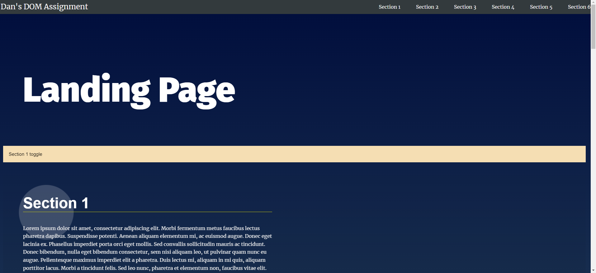
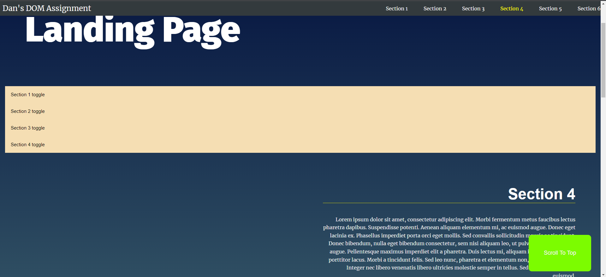

# Assignment 2: Manipulating the DOM

<!-- Add buttons here -->

This is my code entry for the second assignment of the Udacity Front End nanodegree: Manipulating the DOM. This project consists of the following key elements: A dynamically created responsive navigation bar, collapsible sections, text highlighting on scrolling through the page and the ability to quickly jump to the top of the page.

# Demo-Preview




# Table of contents

- [Demo-Preview](#demo-preview)
- [Table of contents](#table-of-contents)
- [Installation](#installation)
- [Development](#development)

- [License](#license)
- [Footer](#footer)

# Installation

[(Back to top)](#table-of-contents)

To use this project, first clone the repo on your device using the command below:
```git init```
```git clone https://github.com/DcoltGaming/DcoltGaming.github.io/blob/main/Assignment2``` 

From here, you will be able to load the index.html file.


# Development

[(Back to top)](#table-of-contents)

The code is principally made up of four sections:

### The Navigation bar
The code pulls all the HTML elements with the tag "section" and then this collection is looped through. With each pass, a li and a 'a' are set up, the h2 tag of the section is assigned as the name, and a 'href' to that section is created. The li is then appended to the 'ul' that makes up the navigation bar.

### Adding the active class near to the top of the viewport
Here a bounding rectangle is setup and the style of the visible element selected. A check is made to see if the current element is inside the window view. If it returns true, the code checks whether or not the element has the tag of 'section' and if it does, it looks up the relating 'li' in the nav and adds the class list 'active'.

### Scroll to anchor ID
This attaches a listener event to all hrefs marked with '#' to create a scroll event to their corresponding section.

### Collapsible sections
Here the code loops through all section elements and dynamically creates a 'collapse' button for them. It then inserts this above the element. It has a listener event that either sets the display style to block or to none; depending on it's current state, in order to hide or unhide the section.

# License

[(Back to top)](#table-of-contents)

[GNU General Public License version 3](https://opensource.org/licenses/GPL-3.0)

# Footer

[(Back to top)](#table-of-contents)


